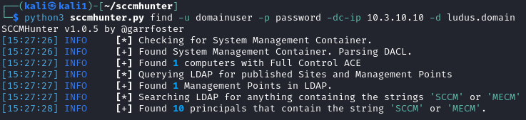
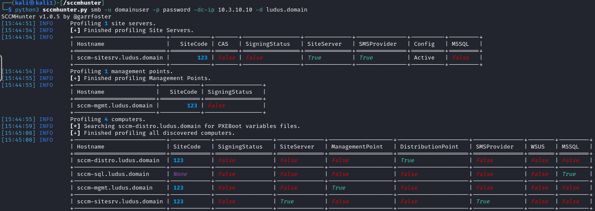

# 1 - Recon Lab Walkthrough
## Objectives
1. Identify SCCM principals within the network
2. Identify the SCCM site code
3. Identify the Management Point
4. Identify the Primary Site Server
5. Identify the Distribution Point
6. Identify any SCCM related accounts
## Step 1
Using SCCMHunter, execute the ***find*** command using your credentials. This will query the LDAP System Management Container and begin populating your database. 

```
python3 sccmhunter.py find -u <username> -p <password> -dc-ip <dc-ip> -d ludus.domain
```

<div align="center">

</div>

## Step 2
Use SCCMHunter's SMB module to profile the discovered SCCM principals. Take note of the SCCM principals and their corresponding roles. 
```
python3 sccmhunter.py smb -u <username> -p <password> -dc-ip <dc-ip> -d ludus.domain
```
<div align="center">

</div>